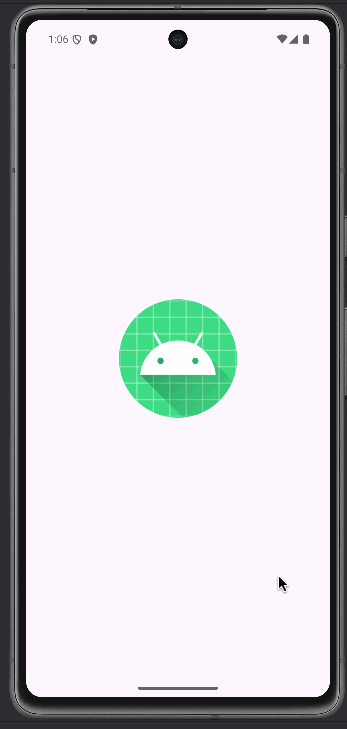

# CMPU-203 F24 - Team 1D

## VassarEats

## Description
VassarEats is a robust, highly interactive dining application that aids users (Vassar students, staff, and visitors) to
make informed dining decisions quicker. It pulls all the dining information from [Vassar dining website](https://vassar.cafebonappetit.com/).
It is a better alternative to this website because it adds important features which are not in the website. Some of these
features are allowing customers to like or dislike dining options and view images of food items. This enhances user experience
as users can make dining decisions based on the preferences of other users and also view images of food items to know
what to expect.

## Live Demo:
Below is a video walkthrough of the VassarEats prototype, showing its current main features and functionalities.

## How to run the prototype
Run the app on Android Studio. When the program is run, it will welcome you to Vassar Eats and display the food menu for 
Gordon Commons as the default food menu. You can choose your dietary preferences, dates, and different dining locations 
and the food menu will be adjusted accordingly.

## Functionality
We have a prototype that displays all the food menu in an expandable recycler view format. The food menu displayed includes
mealType (e.g. Breakfast, Lunch, etc.), mealTypeSection (e.g. Specials, additional favorites, etc.) and diningSection (e.g.
Stocks, Root, etc.). More so, the food menu can be filtered based on dietary preferences (e.g. vegan, vegetarian, etc.). 
A user can also view food items up to seven days from the current day. Moreover, different dining locations (e.g., Express,
Street Eats) can be selected to view the food menu for that day in those dining locations. We've enabled users
to like/dislike each food item. Another cool functionality we've added is the ability to view images of each
food items.

## Authors and acknowledgment
Special acknowledgment to Aly Camara and Ezekiel Ekanem, authors of the project.

## License
Copyright 2024 (Aly, Ezekiel)

Permission is hereby granted, free of charge, to any person obtaining a copy of this software and associated documentation files (the “Software”), to deal in the Software without restriction, including without limitation the rights to use, copy, modify, merge, publish, distribute, sublicense, and/or sell copies of the Software, and to permit persons to whom the Software is furnished to do so, subject to the following conditions:

The above copyright notice and this permission notice shall be included in all copies or substantial portions of the Software.

THE SOFTWARE IS PROVIDED “AS IS”, WITHOUT WARRANTY OF ANY KIND, EXPRESS OR IMPLIED, INCLUDING BUT NOT LIMITED TO THE WARRANTIES OF MERCHANTABILITY, FITNESS FOR A PARTICULAR PURPOSE AND NONINFRINGEMENT. IN NO EVENT SHALL THE AUTHORS OR COPYRIGHT HOLDERS BE LIABLE FOR ANY CLAIM, DAMAGES OR OTHER LIABILITY, WHETHER IN AN ACTION OF CONTRACT, TORT OR OTHERWISE, ARISING FROM, OUT OF OR IN CONNECTION WITH THE SOFTWARE OR THE USE OR OTHER DEALINGS IN THE SOFTWARE.