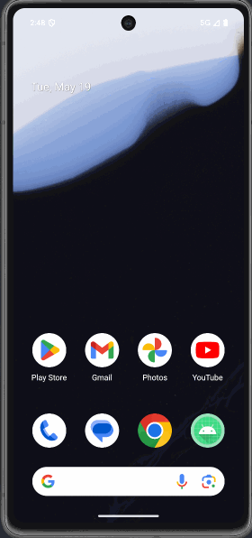

# CMPU-203 F24 - Team 1D

## VassarEats

## Description
VassarEats is a robust, highly interactive dining application that aids users (Vassar students, staff, and visitors) to
make informed dining decisions quicker. It pulls all the dining information from [Vassar dining website](https://vassar.cafebonappetit.com/).
It is a better alternative to this website because it adds important features which are not in the website. Some of these
features are allowing customers to like or dislike dining options and view images of food items. This enhances user experience
as users can make dining decisions based on the preferences of other users and also view images of food items to know
what to expect.

## Live Demo:
Below is a video walkthrough of the VassarEats prototype, showing its current main features and functionalities.

## How to run the prototype
Run the app on Android Studio. When the program is run, it will welcome you to Vassar Eats and display the food menu for 
Gordon Commons as the default food menu. You can choose your dietary preferences, dates, and different dining locations 
and the food menu will be adjusted accordingly.

## Functionality

Vassar Eats is a feature-rich Android application designed to overhaul the student dining experience. Below is a breakdown of the core functionalities currently supported by the platform:

### Menu Exploration & Smooth UI
* **Dynamic Menu Layout:** Displays daily menus using a highly responsive, expandable `RecyclerView` format. Menus are categorized cleanly by **Meal Type** (Breakfast, Lunch, Dinner), **Meal Section** (Specials, Additional Favorites), and **Dining Section** (Stocks, Root, etc.).
* **Location & Date Toggling:** Users can view menus across multiple campus dining locations (e.g., Express, Street Eats) up to seven days in advance.
* **Enhanced Navigation Gestures:** Date navigation is incredibly fluid, utilizing full-body swipe responsiveness across the entire screen instead of being limited to the top bar.
* **Dietary Filtering:** Menus can be dynamically filtered in real-time based on individual dietary preferences and restrictions (e.g., Vegan, Vegetarian, Made without Gluten).

### AI-Powered Food Imagery (Nanobanana)
* **Automated Image Generation:** Leveraging the `gemini-2.5-flash` AI model, the app dynamically generates realistic images for scheduled menu items to give students a visual preview of their meals.
* **Low-Latency Performance:** Images are fetched and displayed asynchronously alongside a smooth **shimmering effect** while the AI processes, minimizing user perceived wait times.
* **Optimized Image Pipeline:** Integrates **Glide** for lightning-fast local disk and RAM caching. Images are stored and streamed efficiently utilizing **Firebase Storage** rather than standard Firestore.
* **Community-Driven Moderation:** Features a "Report Image" flag system. If a poorly generated image receives 5 flags from the student community, the app automatically prompts the AI to regenerate a brand-new image for that dish.

### Conversational Nutrition Chatbot
* **Interactive Assistant:** Includes an in-app chatbot powered by `gemini-2.5-flash` capable of answering student questions regarding food ingredients, nutritional advice, and overall dining insights.
* *(In Development)* Future updates will utilize **RAG (Retrieval-Augmented Generation)** to deeply couple the chatbot with the official Vassar Wellness documentation for hyper-localized, campus-specific inquiries.

### Smart Calorie & Nutrition Tracking
* **Nutrition Dialogs:** Tapping on a food item brings up a detailed pop-up dialog displaying calorie content and macronutrient breakdowns.
* **Hybrid Data Sourcing:** The tracker pulls verified nutrition data directly from the Vassar dining website whenever available. For items missing official data, `gemini-2.5-flash` is used to generate highly precise caloric estimates.
* **Data Transparency:** A clear visual tag is appended to the bottom of the nutrition pop-up to explicitly inform users whether the information was pulled from the official Vassar website or estimated by AI.

### Predictive Recommendations *(Beta)*
* **Social Engagement:** Students can "Like" or "Dislike" any food item on the menu.
* **Smart Notifications:** Implements a background recommendation algorithm designed to automatically notify users the moment a dining hall begins serving an item they have previously liked. *(Note: This feature is currently in active testing).*

## Authors and acknowledgment
Special acknowledgment to Aly Camara and Ezekiel Ekanem, authors of the project.

## License
Copyright 2024 (Aly, Ezekiel)

Permission is hereby granted, free of charge, to any person obtaining a copy of this software and associated documentation files (the “Software”), to deal in the Software without restriction, including without limitation the rights to use, copy, modify, merge, publish, distribute, sublicense, and/or sell copies of the Software, and to permit persons to whom the Software is furnished to do so, subject to the following conditions:

The above copyright notice and this permission notice shall be included in all copies or substantial portions of the Software.

THE SOFTWARE IS PROVIDED “AS IS”, WITHOUT WARRANTY OF ANY KIND, EXPRESS OR IMPLIED, INCLUDING BUT NOT LIMITED TO THE WARRANTIES OF MERCHANTABILITY, FITNESS FOR A PARTICULAR PURPOSE AND NONINFRINGEMENT. IN NO EVENT SHALL THE AUTHORS OR COPYRIGHT HOLDERS BE LIABLE FOR ANY CLAIM, DAMAGES OR OTHER LIABILITY, WHETHER IN AN ACTION OF CONTRACT, TORT OR OTHERWISE, ARISING FROM, OUT OF OR IN CONNECTION WITH THE SOFTWARE OR THE USE OR OTHER DEALINGS IN THE SOFTWARE.