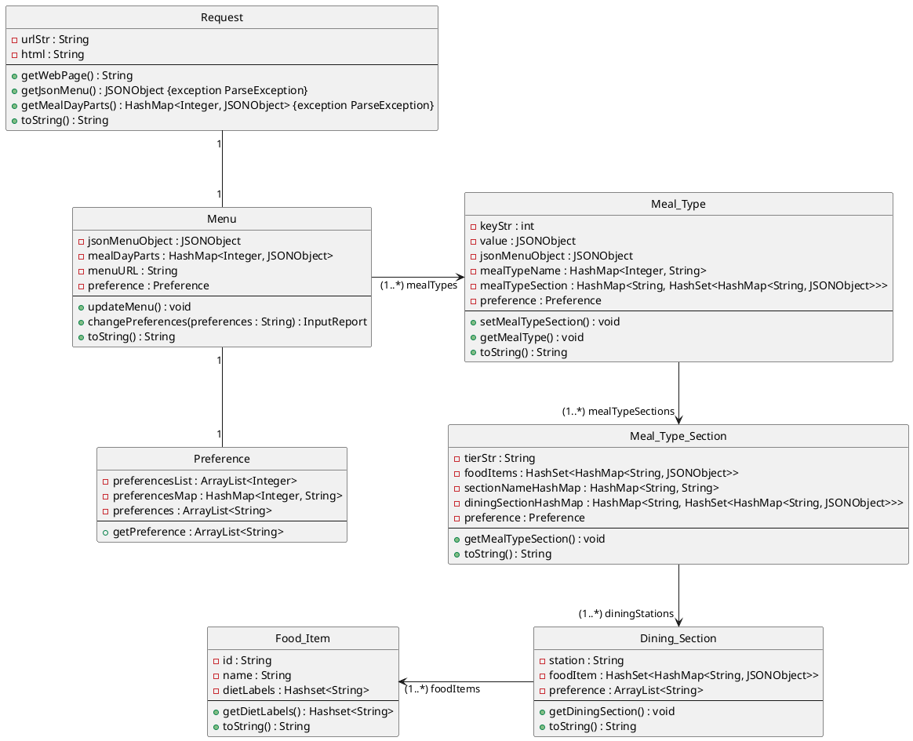

```plantuml
@startuml
hide circle
hide empty methods

' classes
class Menu{
-jsonMenuObject : JSONObject
-mealDayParts : HashMap<Integer, JSONObject>
-menuURL : String
-preference : Preference
--
+updateMenu() : void
+changePreferences(preferences : String) : InputReport
+toString() : String
}

class Food_Item{
-id : String
-name : String
-dietLabels : Hashset<String>
--
+getDietLabels() : Hashset<String> 
+toString() : String
}

class Request{
-urlStr : String
-html : String
--
+getWebPage() : String
+getJsonMenu() : JSONObject {exception ParseException}
+getMealDayParts() : HashMap<Integer, JSONObject> {exception ParseException}
+toString() : String
}

class Preference {
-preferencesList : ArrayList<Integer>
-preferencesMap : HashMap<Integer, String>
-preferences : ArrayList<String>
--
+getPreference : ArrayList<String>
}

class Meal_Type {
-keyStr : int
-value : JSONObject
-jsonMenuObject : JSONObject
-mealTypeName : HashMap<Integer, String>
-mealTypeSection : HashMap<String, HashSet<HashMap<String, JSONObject>>>
-preference : Preference
--
+setMealTypeSection() : void
+getMealType() : void
+toString() : String
}

class Meal_Type_Section {
-tierStr : String
-foodItems : HashSet<HashMap<String, JSONObject>>
-sectionNameHashMap : HashMap<String, String>
-diningSectionHashMap : HashMap<String, HashSet<HashMap<String, JSONObject>>>
-preference : Preference
--
+getMealTypeSection() : void
+toString() : String
}

class Dining_Section {
-station : String
-foodItem : HashSet<HashMap<String, JSONObject>>
-preference : ArrayList<String>
--
+getDiningSection() : void
+toString() : String
}

' associations

Menu "1" -up- "1" Request : \t
Menu -> "(1..*) mealTypes" Meal_Type : \t\t\t
Meal_Type -down-> "(1..*) mealTypeSections" Meal_Type_Section : \t\t\t\t\t
Meal_Type_Section -down-> "(1..*) diningStations" Dining_Section : \t\t\t\t\t
Dining_Section -left-> "(1..*) foodItems" Food_Item : \t\t\t\t\t
Menu "1" -down- "1" Preference : \t\t\t\t\t


@end
```