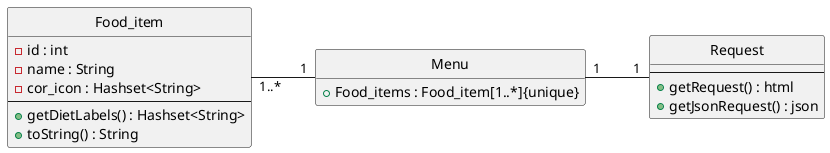

```plantuml
@startuml
hide circle
hide empty methods

' classes
class Menu{
+Food_items : Food_item[1..*]{unique}
}
class Food_item{
-id : int
-name : String
-cor_icon : Hashset<String>
--
+getDietLabels() : Hashset<String> 
+toString() : String
}
class Request{
--
+getRequest() : html
+getJsonRequest() : json
}

' associations
Food_item "1..*" - "1" Menu : \t
Menu "1" - "1" Request : \t

@end
```