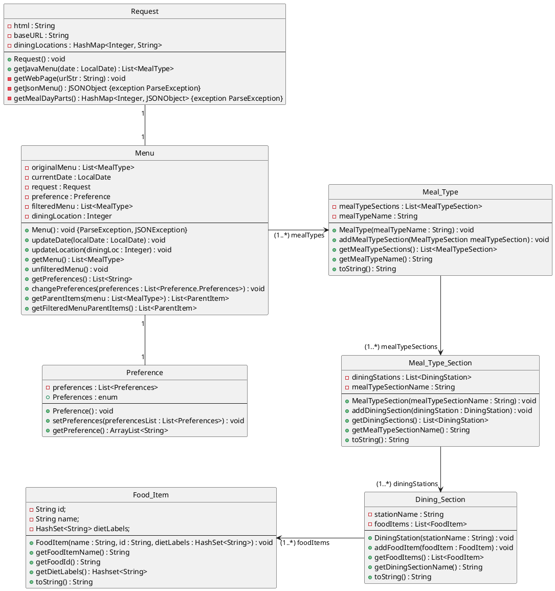

```plantuml
@startuml
hide circle
hide empty methods

' classes
class Menu{
-originalMenu : List<MealType>
-currentDate : LocalDate
-request : Request
-preference : Preference
-filteredMenu : List<MealType>
-diningLocation : Integer
--
+Menu() : void {ParseException, JSONException}
+updateDate(localDate : LocalDate) : void
+updateLocation(diningLoc : Integer) : void
+getMenu() : List<MealType> 
+unfilteredMenu() : void
+getPreferences() : List<String> 
+changePreferences(preferences : List<Preference.Preferences>) : void
+getParentItems(menu : List<MealType>) : List<ParentItem>
+getFilteredMenuParentItems() : List<ParentItem>
}

class Food_Item{
-String id;
-String name;
-HashSet<String> dietLabels;
--
+FoodItem(name : String, id : String, dietLabels : HashSet<String>) : void 
+getFoodItemName() : String
+getFoodId() : String
+getDietLabels() : Hashset<String> 
+toString() : String
}

class Request{
-html : String
-baseURL : String
-diningLocations : HashMap<Integer, String>
--
+Request() : void
+getJavaMenu(date : LocalDate) : List<MealType>
-getWebPage(urlStr : String) : void
-getJsonMenu() : JSONObject {exception ParseException}
-getMealDayParts() : HashMap<Integer, JSONObject> {exception ParseException}
}

class Preference {
- preferences : List<Preferences>
+ Preferences : enum
--
+Preference() : void
+setPreferences(preferencesList : List<Preferences>) : void
+getPreference() : ArrayList<String>
}

class Meal_Type {
-mealTypeSections : List<MealTypeSection>
-mealTypeName : String
--
+MealType(mealTypeName : String) : void
+addMealTypeSection(MealTypeSection mealTypeSection) : void
+getMealTypeSections() : List<MealTypeSection>
+getMealTypeName() : String
+toString() : String
}

class Meal_Type_Section {
-diningStations : List<DiningStation>
-mealTypeSectionName : String
--
+MealTypeSection(mealTypeSectionName : String) : void
+addDiningSection(diningStation : DiningStation) : void
+getDiningSections() : List<DiningStation>
+getMealTypeSectionName() : String
+toString() : String
}

class Dining_Section {
-stationName : String
-foodItems : List<FoodItem>
--
+DiningStation(stationName : String) : void
+addFoodItem(foodItem : FoodItem) : void
+getFoodItems() : List<FoodItem>
+getDiningSectionName() : String
+toString() : String
}

' associations

Menu "1" -up- "1" Request : \t
Menu -> "(1..*) mealTypes" Meal_Type : \t\t\t
Meal_Type -down-> "(1..*) mealTypeSections" Meal_Type_Section : \t\t\t\t\t
Meal_Type_Section -down-> "(1..*) diningStations" Dining_Section : \t\t\t\t\t
Dining_Section -left-> "(1..*) foodItems" Food_Item : \t\t\t\t\t
Menu "1" -down- "1" Preference : \t\t\t\t\t


@end
```