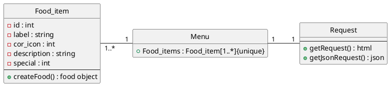

```plantuml
@startuml
hide circle
hide empty methods

' classes
class Menu{
+Food_items : Food_item[1..*]{unique}
}
class Food_item{
-id : int
-label : string
-cor_icon : int
-description : string
-special : int
--
+createFood() : food object
}
class Request{
--
+getRequest() : html
+getJsonRequest() : json
}

' associations
Food_item "1..*" - "1" Menu : \t
Menu "1" - "1" Request : \t

@end
```