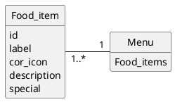

```plantuml
@startuml
hide circle
hide empty methods

' classes
class Menu{
Food_items
}
class Food_item{
id
label
cor_icon
description
special
}

' associations
Food_item "1..*" - "1" Menu : \t

@end
```