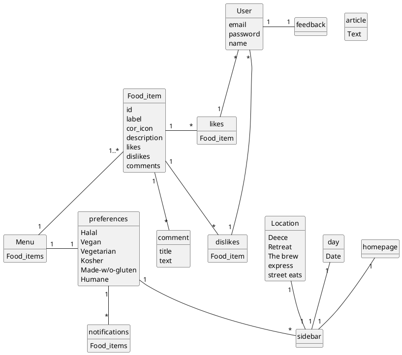

```plantuml
@startuml
hide circle
hide empty methods

' classes
class User{
email
password
name

}
class Menu{
Food_items
}
class Food_item{
id
label
cor_icon
description
likes
dislikes
comments
}
class Location {
Deece
Retreat
The brew
express
street eats
}
class day {
Date
}
class preferences {
Halal
Vegan
Vegetarian
Kosher
Made-w/o-gluten
Humane

}
class homepage {

}
class comment {
title
text
}
class notifications {
Food_items
}
class article {
Text
}
class feedback {

}
class likes {
Food_item
}
class dislikes {
Food_item
}
class sidebar {

}

' associations
Food_item "1" -- "*" comment : \t
Food_item "1..*" -- "1" Menu : \t
Food_item "1" - "*" likes : \t
Food_item "1" -- "*" dislikes : \t
Menu "1" - "1" preferences : \t
preferences "1" -- "*" notifications : \t
preferences "1" -- "*" sidebar : \t
Location "1" -- "1" sidebar : \t
day "1" -- "1" sidebar : \t
homepage "1" -- "1" sidebar : \t
User "1" - "1" feedback : \t
User "*" -- "1" likes : \t
User "*" - "1" dislikes : \t

@end
```