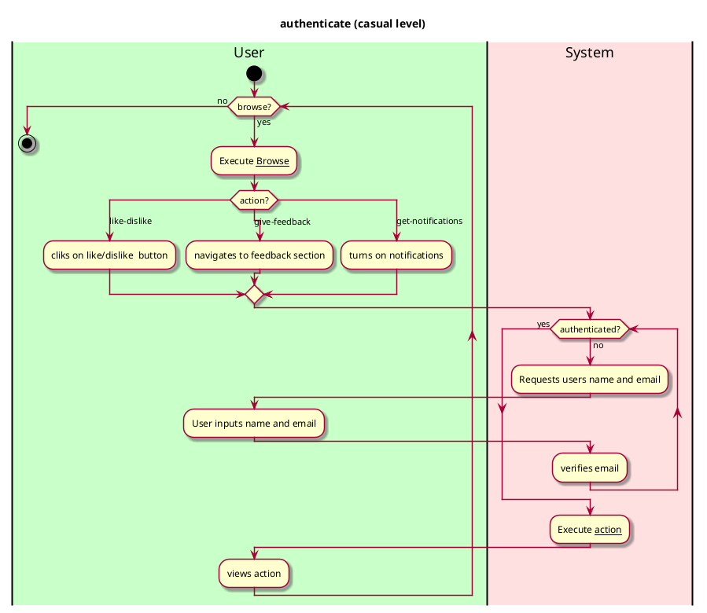

# Authenticate

## 1. Primary actor and goals
__System__: It authenticates a user to ensure that they are Vassar students or staff so that they can successfully 
like/dislike food items, give feedback, or get food notifications from the app.

## 2. Other stakeholders and their goals
__Vassar staff and students__: wants to get authenticated so that they can like/dislike a food item, give feedback, and
get notifications from the app

## 3. Preconditions
* The browse use case works

## 4. Postconditions
* Authentication is saved
* Users are able to get notified of food recommended by the app
* Users are able to successfully like/dislike a food item and give feedback to dining administrators

## 4. Workflow

