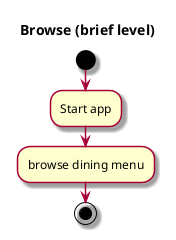

# Browse

## 1. Primary actor and goals

__Vassar students, staff, and visitors__: wants to browse through the dining menu quickly and see information clearly in order to help them make decisions faster

## 2. Other stakeholders and their goals
None

## 3. Preconditions

* The app is able to access dining options from the dining website *https://vassar.cafebonappetit.com/*.

## 4. Postconditions

* Dining menu is shown clearly with food items' information

## 4. Workflow

