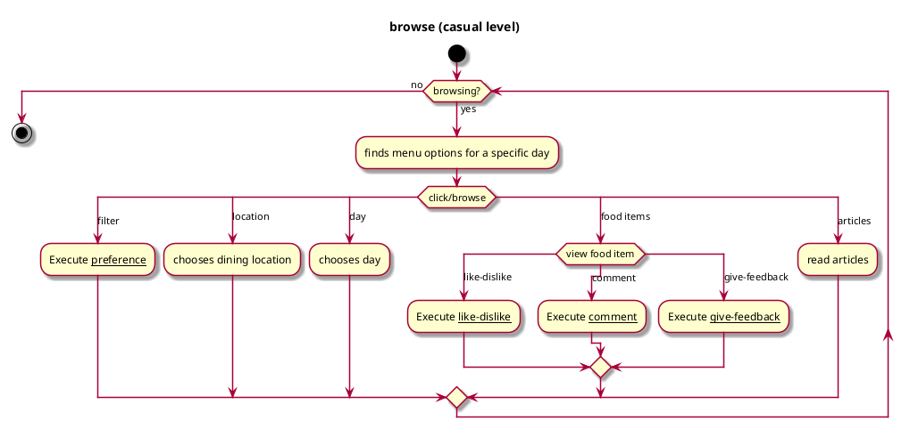
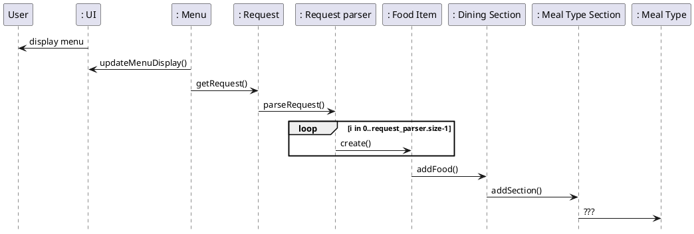

# Browse

## 1. Primary actor and goals

__Vassar students, staff (including dining administrators), and visitors__: wants to browse through the dining menu 
quickly and see information clearly in order to help them make decisions faster

## 2. Other stakeholders and their goals
__System__: displays dining menu for users to browse and enables users to perform further actions on the app, such as 
like/dislike food items, give comments, read articles, etc.

## 3. Preconditions

* The app is able to access dining options from the dining website *https://vassar.cafebonappetit.com/*.

## 4. Postconditions

* Dining menu is shown clearly with food items' information in a consistent format
* The following are the food items' information that will be shown:
  * A photo of each food item
  * The name of each food item
  * Like and dislike buttons for each food item
  * Comment section for each food item
  * If the food is part of the recommended section, a ***star*** feature will appear close to the food's name
* There will be a section to filter food via dietary preferences (e.g. Vegetarian, Vegan, etc) or via recommended food
choices
* The default menu will be the current day's menu, but users can select the menu of future dates 
* The default dining center that will be shown on the app will be the Gordon Commons, but their will be a section where
users can check the menu of other dining centers, such as Retreat, The Brew, Express, and Street Eats. 
* There will also be a section where people can read food and wellness articles
* There will be a section for giving feedback to the dining services as well as links to connect with them on social 
media
* Students and staff members should be able to like or dislike menu option and give feedback.

## 4. Workflow

## Sequence Diagram

