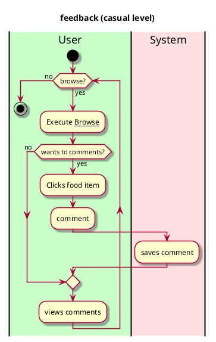

# Feedback

## 1. Primary actor and goals

__Vassar staff and visitors__: wants to comment on food items in the menu

## 2. Other stakeholders and their goals

No other stake holders

## 3. Preconditions

* The browse use case works

## 4. Postconditions

* Comment is saved
* Comment is visible across all devices

## 4. Workflow

