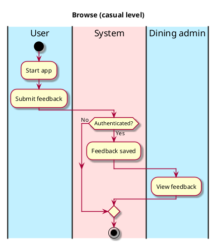

# Feedback

## 1. Primary actor and goals

__Vassar students and staff__: wants to give feedback to vassar dining admin in order to see potential changes

## 2. Other stakeholders and their goals

__Vassar dining administration__: wants to view vassar students' and staffs' feedback on food items

__Visitors__: wants to see what feedback vassar students and staff have of dining options which may help them make more informed decisions about dining

## 3. Preconditions

* Users and administrators are identified and authenticated.

## 4. Postconditions

* Feedback is saved

## 4. Workflow

