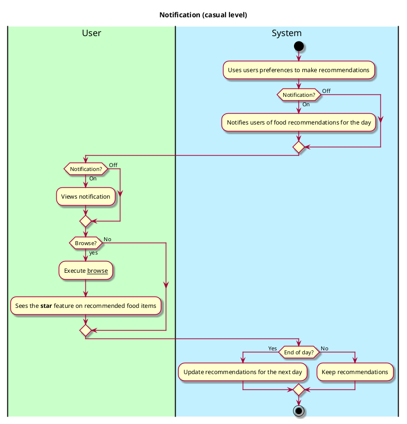

# Get Notifications

## 1. Primary actor and goals

__System__: It notifies users of certain food items that are available on a specific day based on the user's preferences 
(e.g. likes, dislikes, vegetarian food, vegan, halal, etc.). It recommends food across all the dining options at Vassar 
(e.g. Gordon Commons, Retreat, Street eats, etc.), and it recommends both food for the current day and for future days 
(up to one week from the current day).

## 2. Other stakeholders and their goals

* __User (students, staff)__: They are notified of the daily recommendations made by the system. They can choose to turn
on/off their notifications. 

## 3. Preconditions

* Browse use case works
* Users can like/dislike food items
* Users can select their food preference
* Authentication works

## 4. Postconditions

* When browsing through the food options, recommended foods are denoted by a ***star*** feature.
* Users get notified of the notifications on their phones if they turned on their notifications.

## 5. Workflow

