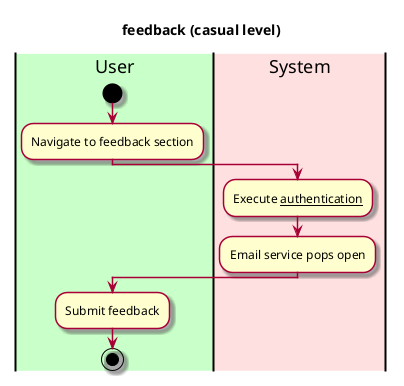

# Feedback

## 1. Primary actor and goals

__Vassar students and staff__: wants to give feedback to vassar dining admin in order to see potential changes

## 2. Other stakeholders and their goals

__Vassar dining administration__: wants to view vassar students' and staffs' feedback on food items

## 3. Preconditions

* Authentication works
* User has email service

## 4. Postconditions

* Emails service apps opens

## 4. Workflow

