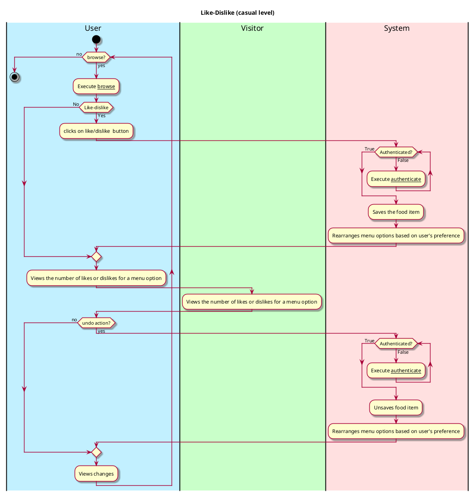

# Like-Dislike

## 1. Primary actor and goals

__Users (students, staff (dining administrators and chefs))__: They want to like or dislike a menu option based on their 
preference. They want to ensure that they can do this with minimal stress and their 'like' or 'dislike' preferences remain 
unchanged except they change it themselves. They also will like to view the dining options for a particular day with their 
'liked' food choices appearing first before other food options. Moreover, they want to be able to view people's total 
preferences for a particular menu option. This information can help dining administrators and chefs to make better dining 
decisions for users.

## 2. Other stakeholders and their goals

* __Visitors__: They want to be able to view people's preference for a particular menu option. This information can help 
them to make better informed dining decisions.
* __System__: It makes sure that only authenticated users can like/dislike a food item. It also saves 'like' or 'dislike'
food items and rearranges the menu items to ensure that liked foods appear first. 

## 3. Preconditions

* The app is able to access dining options from the dining website *https://vassar.cafebonappetit.com/*.
* Users are able to browse the menu options.

## 4. Postconditions

* Users and administrators are identified and authenticated.
* 'Like' or 'dislike' choices are saved.
* The system uses this preference to order the menu (with liked preferences appearing first).
* Users can remove this preference by clicking on the 'like' or 'dislike' button again, and the system correctly responds
to this change.
* Users' 'like' and 'dislike' choices are used by the get-notifications use-case to notify users of recommended food 
items in the future.
* Users' 'like' and 'dislike' choices are reflected in the recommendation section of preference use-case

## 5. Workflow

