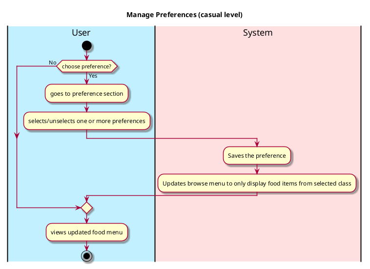
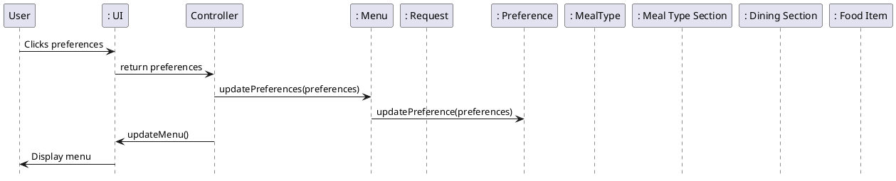

# Preference

## 1. Primary actor and goals

__Users (students, staff) and Visitors__: They want to be able to filter menu items based on their dietary preference, 
such as, vegetarian, vegan, made without gluten-containing ingredients, in balance, halal. They also want to filter menu 
items based on their 'liked' preferences.

## 2. Other stakeholders and their goals

* __System__: It ensures that only food items belonging to the filtered class are shown as the menu options

## 3. Preconditions

* The app is able to access dining options from the dining website *https://vassar.cafebonappetit.com/*.
* Users are able to browse the menu options.
* If authenticated, users are able to like/dislike food items

## 4. Postconditions

* The menu options are updated so that only food items belonging to the filtered class is shown on the browse menu
* If a previously selected class becomes unselected, the system updates the menu options accordingly

## 5. Workflow

## Sequence Diagram

