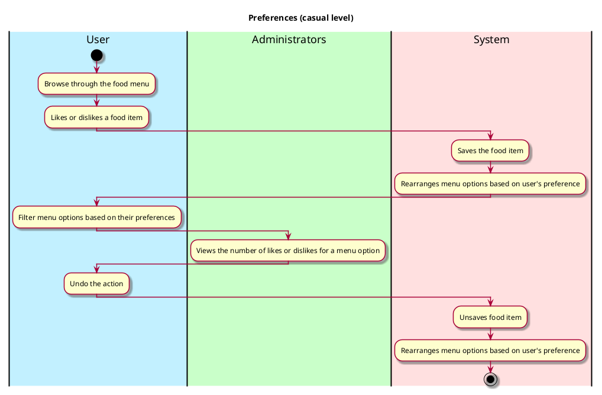

# Preference

## 1. Primary actor and goals

__Users (students, staff)__: They want to like or dislike a menu option based on their preference. They 
want to ensure that they can do this with minimal stress and their 'like' or 'dislike' preferences remain unchanged 
except they change it themselves. They also will like to view the dining options for a particular day with their 'liked'
food choices appearing first before other food options. 

## 2. Other stakeholders and their goals

* __Dining administrators and chefs__: They want to be able to view people's preference for a particular menu option. 
This information can help them to make better dining decisions for users.

## 3. Preconditions

* Users and administrators are identified and authenticated.
* The app is able to access dining options from the dining website *https://vassar.cafebonappetit.com/*.
* Users are able to browse the menu options.

## 4. Postconditions

* 'Like' or 'dislike' choices are saved.
* The system uses this preference to order the menu (with liked preferences appearing first).
* Users can remove this preference by clicking on the 'like' or 'dislike' button again, and the system correctly responds
to this change.

## 5. Workflow

