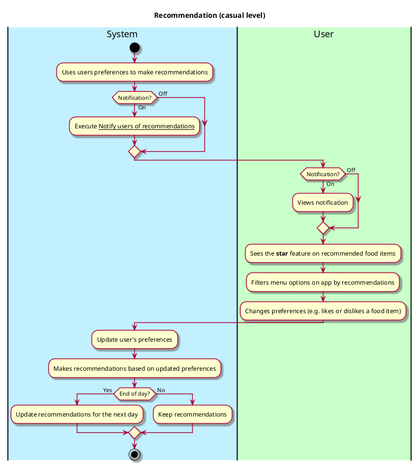

# Reccommendation

## 1. Primary actor and goals

__System__: It recommends food items to the user based on the user's preferences (e.g. likes, dislikes, vegetarian food,
vegan, halal, etc.). It recommends food across all the dining options at Vassar (e.g. Gordon Commons, Retreat, Street
eats, etc.). It recommends both food for the current day and for future days (up to one week from the current day).

## 2. Other stakeholders and their goals

* __User (students, staff)__: They are notified of the daily recommendations made by the system. They can choose to turn
on/off their notifications. 

## 3. Preconditions

* Users and administrators are identified and authenticated.
* The app is able to access dining options from the dining website *https://vassar.cafebonappetit.com/*.
* Users are able to browse the menu options.
* Users can like/dislike menu items.
* Users can turn on/off notifications.

## 4. Postconditions

* Users can view the recommendations by using the filter option.
* When browsing through the food options, recommended foods are denoted by a ***star*** feature.
* Users get notified of the notifications on their phones if they turned on their notifications.

## 5. Workflow

