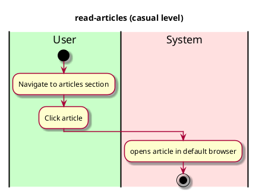

# Read articles

## 1. Primary actor and goals

__Vassar staff and visitors__: wants to read articles about food and wellness

## 2. Other stakeholders and their goals

No other stake holders

## 3. Preconditions

No preconditions

## 4. Postconditions

* The article's page opens on the user's default browser

## 4. Workflow

